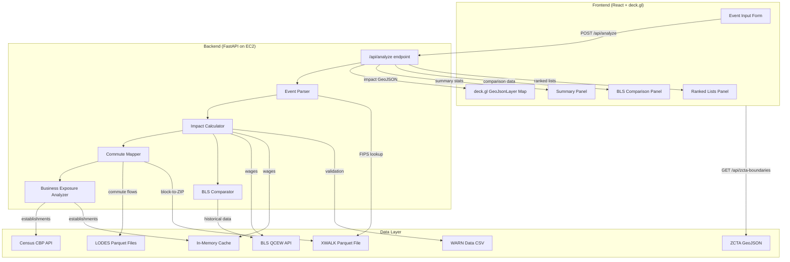
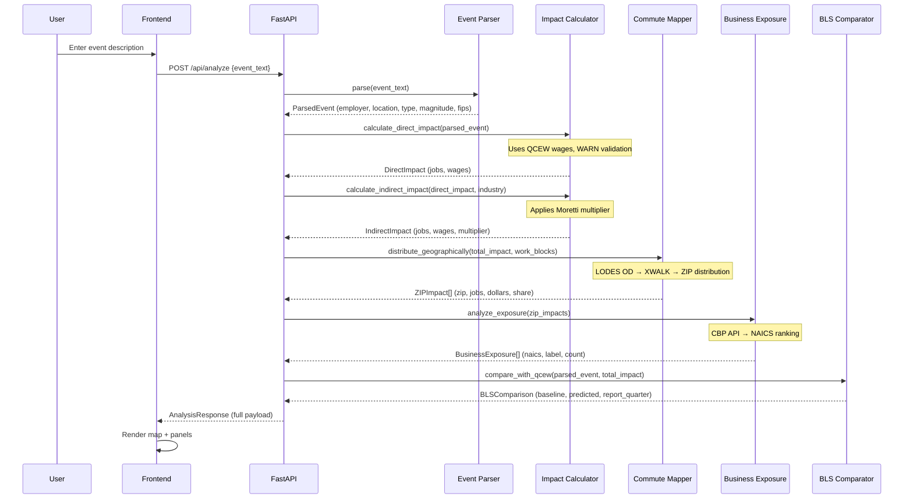

# Design Document: Economic Blast Radius Engine

## Overview

The Economic Blast Radius Engine is a single-page web application that predicts the economic ripple effects of major employer events on surrounding local economies. Given a natural-language event description (e.g., "Intel lays off 1,500 workers at Chandler, AZ fab"), the engine produces a geospatial heatmap with dollar-figure impact estimates, affected ZIP codes, and exposed business categories — surfacing predictions 6–18 months before BLS data catches up.

The system follows a three-tier architecture: a React + deck.gl frontend, a Python (FastAPI) backend API, and a data layer combining pre-cached Census/BLS datasets with on-demand API calls. The design prioritizes hackathon-speed development (11 hours, 3-person team) and demo-ready sub-5-second response times when data is cached.

### Key Design Decisions

1. **FastAPI over Lambda**: A single FastAPI server on EC2 avoids cold-start latency and simplifies the data pipeline (pandas DataFrames stay in memory). For an 11-hour build, this is faster to develop and debug than a Lambda-based architecture.
2. **Pre-cached LODES + XWALK in Parquet**: The Arizona LODES OD file (~400KB gzipped CSV) and XWALK file (~8.2M rows) are pre-downloaded and converted to Parquet at build time. Parquet gives 5–10x faster reads than CSV with pandas.
3. **GeoJsonLayer over HeatmapLayer**: deck.gl's `GeoJsonLayer` with ZCTA boundary polygons provides clearer per-ZIP-code impact visualization than a continuous heatmap. Users can hover/click individual ZIP codes for details.
4. **Simple regex-based parsing over NLP**: For the hackathon demo, a regex + keyword extraction parser is sufficient. The input format is semi-structured (employer, location, event type, magnitude), and the demo will use a pre-filled example.
5. **In-memory dict cache over DynamoDB**: For the hackathon, Python dict-based caching with TTL is simpler and faster than DynamoDB. The entire dataset for Arizona fits in memory.

## Architecture

### System Architecture Diagram



### Request Flow



## Components and Interfaces

### Backend Components

#### 1. Event Parser (`event_parser.py`)

Extracts structured event parameters from natural-language input.

```python
class ParsedEvent:
    employer_name: str          # e.g., "Intel"
    city: str                   # e.g., "Chandler"
    state: str                  # e.g., "AZ"
    event_type: EventType       # LAYOFF | PLANT_CLOSURE | ACQUISITION | EARNINGS_MISS
    magnitude_type: str         # "percentage" | "headcount"
    magnitude_value: float      # e.g., 1500 or 0.15
    county_fips: str            # e.g., "04013" (Maricopa County)
    work_zip_codes: list[str]   # ZIP codes encompassing employer location
    work_census_blocks: list[str]  # Census blocks for employer location

class EventType(Enum):
    LAYOFF = "layoff"
    PLANT_CLOSURE = "plant_closure"
    ACQUISITION = "acquisition"
    EARNINGS_MISS = "earnings_miss"
```

**Interface:**
- `parse_event(text: str) -> ParsedEvent` — Extracts fields via regex patterns. Raises `ParseError` with specific missing-field messages.
- `resolve_location(city: str, state: str, xwalk_df: DataFrame) -> tuple[str, list[str], list[str]]` — Returns (county_fips, zip_codes, census_blocks) using XWALK data.

#### 2. Impact Calculator (`impact_calculator.py`)

Computes direct and indirect job losses and dollar impact.

```python
class DirectImpact:
    direct_jobs_lost: int
    source: str                 # "user_input" | "qcew_estimate"
    warn_jobs: int | None       # WARN-reported figure if available
    warn_date: str | None

class IndirectImpact:
    indirect_jobs_lost: int
    multiplier_used: float      # e.g., 3.0
    multiplier_source: str      # "Moretti (2010)"
    industry_category: str      # "high-tech" | "manufacturing"
    plausibility_warning: str | None  # Set if >50% of county employment

class DollarImpact:
    total_wage_loss: float
    retail_revenue_loss: float  # total_wage_loss * 0.60
    avg_annual_wage: float
    spending_rate: float        # 0.60
    quarterly_retail_loss: float  # retail_revenue_loss / 4
```

**Interface:**
- `calculate_direct_jobs(event: ParsedEvent, qcew_data: dict) -> DirectImpact`
- `calculate_indirect_jobs(direct: DirectImpact, industry: str) -> IndirectImpact`
- `calculate_dollar_impact(total_jobs: int, county_fips: str, naics: str, qcew_data: dict) -> DollarImpact`
- `get_moretti_multiplier(industry: str) -> float` — Returns 3.0 for high-tech/semiconductor, 1.6 for manufacturing.

#### 3. Commute Mapper (`commute_mapper.py`)

Distributes impact geographically using LODES commute flows.

```python
class ZIPImpact:
    zip_code: str
    share: float                # Proportion of total impact (0.0–1.0)
    estimated_jobs_lost: int
    estimated_dollar_impact: float
    distance_miles: float       # From employer location
    lat: float
    lon: float
```

**Interface:**
- `distribute_impact(work_blocks: list[str], total_jobs: int, total_dollars: float, lodes_df: DataFrame, xwalk_df: DataFrame, radius_miles: float = 15.0) -> list[ZIPImpact]`
- `get_top_zips(zip_impacts: list[ZIPImpact], n: int = 10) -> list[ZIPImpact]`

#### 4. Business Exposure Analyzer (`business_exposure.py`)

Identifies most-exposed business categories by NAICS.

```python
class BusinessExposure:
    naics_code: str             # 2-digit NAICS
    naics_label: str            # e.g., "Retail Trade"
    establishment_count: int    # In affected ZIPs
    exposure_score: float       # establishment_count * weighted_impact
    data_suppressed: bool       # True if CBP returned "D" values

class ExposureSummary:
    top_categories: list[BusinessExposure]  # Top 5
    total_affected_businesses: int
    affected_zip_count: int
```

**Interface:**
- `analyze_exposure(zip_impacts: list[ZIPImpact], cbp_data: dict) -> ExposureSummary`
- `fetch_cbp_data(zip_codes: list[str]) -> dict` — Queries Census CBP API, caches results.

#### 5. BLS Comparator (`bls_comparator.py`)

Generates the comparison panel data.

```python
class BLSComparison:
    baseline_employment: int
    baseline_wages: float
    baseline_quarter: str       # e.g., "2024 Q2"
    predicted_employment: int
    predicted_wage_loss: float
    projected_report_quarter: str  # e.g., "2025 Q3"
    label_reported: str         # "BLS Reported"
    label_predicted: str        # "Engine Predicted"
```

**Interface:**
- `build_comparison(event: ParsedEvent, total_impact: DollarImpact, qcew_data: dict) -> BLSComparison`

#### 6. Data Pipeline (`data_pipeline.py`)

Manages data loading, caching, and API calls.

**Interface:**
- `load_lodes(state: str) -> DataFrame` — Loads pre-cached Parquet LODES OD file.
- `load_xwalk(state: str) -> DataFrame` — Loads pre-cached Parquet XWALK file.
- `fetch_qcew(county_fips: str, year: int, quarter: int) -> dict` — Fetches from BLS API with 24h cache.
- `fetch_cbp(zip_codes: list[str]) -> dict` — Fetches from Census API with 7-day cache.
- `load_warn_data(state: str) -> DataFrame` — Loads pre-downloaded WARN CSV.
- `load_zcta_geojson() -> dict` — Loads ZCTA boundary GeoJSON for frontend.

### Frontend Components

#### 7. React App Structure

```
src/
├── App.tsx                    # Main layout — single-page view
├── components/
│   ├── EventInput.tsx         # Text input + submit button
│   ├── ImpactMap.tsx          # deck.gl DeckGL + GeoJsonLayer
│   ├── SummaryPanel.tsx       # Headline stats (jobs, dollars, businesses)
│   ├── ZIPRankList.tsx        # Top 10 ZIP codes table
│   ├── BusinessRankList.tsx   # Top 5 NAICS categories table
│   ├── BLSComparisonPanel.tsx # Side-by-side BLS comparison
│   ├── SourceAttribution.tsx  # Data source footer
│   └── MapTooltip.tsx         # Hover/click tooltip for ZIP polygons
├── hooks/
│   ├── useAnalysis.ts         # API call hook
│   └── useZCTABoundaries.ts   # Loads ZCTA GeoJSON
├── types/
│   └── index.ts               # TypeScript interfaces matching backend models
└── utils/
    └── formatters.ts          # Dollar formatting ($340M), number formatting
```

### API Contract

#### POST `/api/analyze`

**Request:**
```json
{
  "event_text": "Intel announces 1,500 layoffs at Chandler, AZ semiconductor fab"
}
```

**Response:**
```json
{
  "parsed_event": {
    "employer_name": "Intel",
    "city": "Chandler",
    "state": "AZ",
    "event_type": "layoff",
    "magnitude_value": 1500,
    "magnitude_type": "headcount",
    "county_fips": "04013"
  },
  "direct_impact": {
    "direct_jobs_lost": 1500,
    "source": "user_input",
    "warn_jobs": 1400,
    "warn_date": "2024-08-15"
  },
  "indirect_impact": {
    "indirect_jobs_lost": 4500,
    "multiplier_used": 3.0,
    "multiplier_source": "Moretti (2010)",
    "industry_category": "high-tech",
    "plausibility_warning": null
  },
  "dollar_impact": {
    "total_wage_loss": 567000000,
    "retail_revenue_loss": 340200000,
    "quarterly_retail_loss": 85050000,
    "avg_annual_wage": 94500,
    "spending_rate": 0.60
  },
  "zip_impacts": [
    {
      "zip_code": "85225",
      "share": 0.18,
      "estimated_jobs_lost": 1080,
      "estimated_dollar_impact": 61236000,
      "distance_miles": 2.3,
      "lat": 33.3062,
      "lon": -111.8413
    }
  ],
  "exposure_summary": {
    "top_categories": [
      {
        "naics_code": "72",
        "naics_label": "Accommodation and Food Services",
        "establishment_count": 487,
        "exposure_score": 87.6,
        "data_suppressed": false
      }
    ],
    "total_affected_businesses": 1847,
    "affected_zip_count": 23
  },
  "bls_comparison": {
    "baseline_employment": 45200,
    "baseline_wages": 4280000000,
    "baseline_quarter": "2024 Q2",
    "predicted_employment": 39200,
    "predicted_wage_loss": 567000000,
    "projected_report_quarter": "2025 Q3",
    "label_reported": "BLS Reported",
    "label_predicted": "Engine Predicted"
  },
  "headline": "4,500 indirect jobs at risk across 1,847 small businesses within 15-mile radius",
  "sources": [
    "Census LEHD LODES 2023",
    "BLS QCEW 2024 Q2",
    "Census CBP 2022",
    "WARN Act Notices (AZ)"
  ]
}
```

#### GET `/api/zcta-boundaries`

Returns the pre-loaded ZCTA GeoJSON for Arizona ZIP codes. Served as a static file from the backend to avoid re-fetching on each analysis.

## Data Models

### LODES Origin-Destination (OD) DataFrame

Pre-cached as Parquet. Key columns used:

| Column | Type | Description |
|--------|------|-------------|
| `w_geocode` | str (15-digit) | Work census block GEOID |
| `h_geocode` | str (15-digit) | Home (residence) census block GEOID |
| `S000` | int | Total jobs |
| `SE01` | int | Jobs with earnings $1,250/month or less |
| `SE02` | int | Jobs with earnings $1,251–$3,333/month |
| `SE03` | int | Jobs with earnings >$3,333/month |

### XWALK Geographic Crosswalk DataFrame

Pre-cached as Parquet. Key columns used:

| Column | Type | Description |
|--------|------|-------------|
| `tabblk2020` | str (15-digit) | 2020 Census block GEOID |
| `zcta` | str (5-digit) | ZIP Code Tabulation Area |
| `cty` | str (5-digit) | County FIPS code |
| `stname` | str | State name |
| `ctyname` | str | County name |
| `blklat` | float | Census block centroid latitude |
| `blklon` | float | Census block centroid longitude |

### QCEW Response (cached dict)

Key fields from BLS QCEW CSV response:

| Field | Type | Description |
|-------|------|-------------|
| `area_fips` | str | County FIPS code |
| `own_code` | str | Ownership code (5 = private) |
| `industry_code` | str | NAICS industry code |
| `annual_avg_emplvl` | int | Annual average employment |
| `avg_wkly_wage` | int | Average weekly wage |
| `total_annual_wages` | int | Total annual wages |

### CBP Response (cached dict)

Key fields from Census CBP API JSON:

| Field | Type | Description |
|-------|------|-------------|
| `ESTAB` | str/int | Number of establishments |
| `EMP` | str/int | Employment (may be null/suppressed) |
| `PAYANN` | str/int | Annual payroll ($1,000s) |
| `NAICS2017` | str | NAICS industry code |
| `NAICS2017_LABEL` | str | Industry name |
| `zip code` | str | ZIP code |

### WARN Data DataFrame

Pre-downloaded CSV:

| Column | Type | Description |
|--------|------|-------------|
| `company_name` | str | Employer name |
| `city` | str | City |
| `state` | str | State abbreviation |
| `num_affected` | int | Number of employees affected |
| `notice_date` | date | WARN notice filing date |
| `layoff_date` | date | Effective layoff date |

### ZCTA Boundary GeoJSON

Standard GeoJSON FeatureCollection with ZCTA polygon boundaries:

```json
{
  "type": "FeatureCollection",
  "features": [
    {
      "type": "Feature",
      "properties": {
        "ZCTA5CE20": "85225",
        "ALAND20": 45678901,
        "AWATER20": 123456
      },
      "geometry": {
        "type": "Polygon",
        "coordinates": [[[lon, lat], ...]]
      }
    }
  ]
}
```

### In-Memory Cache Structure

```python
cache = {
    "qcew": {
        "04013_2024_2": {          # key: {fips}_{year}_{quarter}
            "data": {...},
            "fetched_at": datetime,
            "ttl_hours": 24
        }
    },
    "cbp": {
        "85225": {                  # key: zip_code
            "data": {...},
            "fetched_at": datetime,
            "ttl_hours": 168        # 7 days
        }
    }
}
```


## Correctness Properties

*A property is a characteristic or behavior that should hold true across all valid executions of a system — essentially, a formal statement about what the system should do. Properties serve as the bridge between human-readable specifications and machine-verifiable correctness guarantees.*

### Property 1: Event parsing round-trip

*For any* valid combination of (employer_name, city, state, event_type, magnitude_type, magnitude_value), formatting these fields into a natural-language event description string and then parsing that string with the Event_Parser SHALL produce a ParsedEvent whose fields match the original inputs.

**Validates: Requirements 1.1**

### Property 2: Parser error detection for missing or invalid fields

*For any* event description string that is missing a magnitude value OR contains an unrecognizable city/state combination, the Event_Parser SHALL return an error that specifically identifies which field is missing or invalid (magnitude vs. location), and SHALL NOT return a successful ParsedEvent.

**Validates: Requirements 1.2, 1.3**

### Property 3: Location resolution consistency with XWALK

*For any* (city, state) pair that exists in the XWALK crosswalk data, resolving that location SHALL return a county FIPS code and set of ZIP codes such that every returned ZIP code has at least one census block in the XWALK file with a matching county FIPS code.

**Validates: Requirements 1.5**

### Property 4: Direct job loss percentage calculation

*For any* positive headcount and percentage value between 0 and 1 (exclusive), computing direct job losses from a percentage-based event SHALL produce a result equal to round(percentage × headcount).

**Validates: Requirements 2.1**

### Property 5: Indirect job loss via Moretti multiplier

*For any* positive direct job loss count and valid industry sector, the computed indirect job losses SHALL equal direct_jobs_lost × get_moretti_multiplier(industry_sector), where the multiplier is determined solely by the industry classification.

**Validates: Requirements 3.1**

### Property 6: Plausibility warning threshold

*For any* (indirect_jobs_lost, county_total_employment) pair where both are positive integers, the plausibility_warning field SHALL be non-null if and only if indirect_jobs_lost > 0.5 × county_total_employment.

**Validates: Requirements 3.5**

### Property 7: Geographic distribution proportionality and conservation

*For any* set of LODES origin-destination commute flow records and total impact (jobs and dollars), the Commute_Mapper's ZIP-level distribution SHALL satisfy: (a) all ZIP shares are non-negative, (b) all ZIP shares sum to 1.0 (within floating-point tolerance), (c) each ZIP's share equals its commute flow to the work blocks divided by the total commute flow, and (d) each ZIP's dollar impact equals total_dollars × that ZIP's share.

**Validates: Requirements 4.1, 4.3, 5.4**

### Property 8: Top-N ranking correctness

*For any* list of items with numeric scores and any positive integer N, selecting the top N items SHALL return exactly min(N, len(items)) items sorted in descending order by score, and every returned item's score SHALL be greater than or equal to every non-returned item's score.

**Validates: Requirements 4.4, 6.2, 6.3**

### Property 9: Radius filter enforcement

*For any* set of ZIP impacts with associated distances and any positive radius value, all ZIP codes in the filtered output SHALL have distance_miles ≤ radius, and no ZIP code with distance_miles ≤ radius SHALL be excluded from the output.

**Validates: Requirements 4.5**

### Property 10: Dollar impact computation chain

*For any* positive total_jobs count and positive avg_annual_wage, the computed dollar impact SHALL satisfy: total_wage_loss == total_jobs × avg_annual_wage, AND retail_revenue_loss == total_wage_loss × 0.60, AND quarterly_retail_loss == retail_revenue_loss / 4.

**Validates: Requirements 5.1, 5.2**

### Property 11: Business exposure weighted sum

*For any* set of (zip_code, establishment_count, zip_impact_share) tuples where all shares are non-negative and sum to 1.0, the total_affected_businesses SHALL equal the sum of (establishment_count × zip_impact_share) for each ZIP, rounded to the nearest integer.

**Validates: Requirements 6.4**

### Property 12: QCEW projected quarter calculation

*For any* event date, the projected QCEW reporting quarter SHALL be the calendar quarter that contains the date (event_quarter_end + 5 months), where event_quarter_end is the last day of the quarter containing the event date.

**Validates: Requirements 8.2**

### Property 13: Cache TTL enforcement

*For any* cache entry with a fetched_at timestamp and a configured TTL, the cache SHALL return the cached data when (current_time - fetched_at) < TTL, and SHALL trigger a re-fetch when (current_time - fetched_at) ≥ TTL.

**Validates: Requirements 9.2, 9.3**

### Property 14: Dollar formatting

*For any* non-negative dollar amount, the formatting function SHALL produce: "$X.XB" for amounts ≥ $1 billion (rounded to nearest $100M), "$XM" for amounts ≥ $1 million (rounded to nearest million), and "$X,XXX" with comma separators for amounts < $1 million. The formatted string SHALL always start with "$".

**Validates: Requirements 10.1**

### Property 15: Headline generation from computed data

*For any* valid analysis result containing (indirect_jobs_lost, total_affected_businesses, radius_miles), the generated headline string SHALL contain all three numeric values formatted as human-readable strings.

**Validates: Requirements 10.4**

## Error Handling

### Event Parser Errors

| Error Condition | Behavior |
|----------------|----------|
| Missing magnitude | Return `ParseError` with `field="magnitude"` and prompt message |
| Invalid city/state | Return `ParseError` with `field="location"` and specific missing-field message |
| Unrecognized event type | Return `ParseError` with `field="event_type"` listing supported types |
| Empty input | Return `ParseError` with `field="event_text"` |

### Data Pipeline Errors

| Error Condition | Behavior |
|----------------|----------|
| QCEW API unreachable | Serve cached data + staleness indicator with cache date |
| CBP API unreachable | Serve cached data + staleness indicator with cache date |
| LODES file missing for state | Fall back to uniform ZIP distribution + data-availability warning |
| XWALK file missing | Fatal error — cannot resolve locations. Return 500 with message |
| Census API key invalid | Return 503 with message to check API key configuration |

### Calculation Errors

| Error Condition | Behavior |
|----------------|----------|
| Indirect jobs > 50% county employment | Set `plausibility_warning` on IndirectImpact |
| CBP data suppressed ("D" values) | Use establishment count only, set `data_suppressed=true` |
| No WARN data found | Set `warn_jobs=null`, `warn_date=null` — not an error |
| Division by zero (no commute flows) | Fall back to uniform distribution across ZIPs in radius |

### Frontend Error States

| Error Condition | Behavior |
|----------------|----------|
| API returns 400 (parse error) | Display error message from API with field-specific guidance |
| API returns 500 | Display "Analysis unavailable — please try again" |
| API timeout (>10s) | Display "Analysis is taking longer than expected" with retry button |
| ZCTA GeoJSON fails to load | Render map without polygon overlays, show point markers instead |

## Testing Strategy

### Property-Based Tests (Hypothesis — Python)

The project will use [Hypothesis](https://hypothesis.readthedocs.io/) for property-based testing in Python. Each property test runs a minimum of 100 iterations with generated inputs.

Each test is tagged with a comment referencing its design property:
```python
# Feature: economic-blast-radius-engine, Property {N}: {property_text}
```

**Property tests to implement:**

1. **Event parsing round-trip** (Property 1) — Generate random (employer, city, state, event_type, magnitude) tuples, format into strings, parse, verify field equality.
2. **Parser error detection** (Property 2) — Generate strings missing magnitude or with invalid locations, verify specific error types.
3. **Location resolution consistency** (Property 3) — Generate city/state pairs from XWALK, verify FIPS and ZIP consistency.
4. **Direct job percentage calculation** (Property 4) — Generate (percentage, headcount) pairs, verify multiplication.
5. **Indirect job multiplier** (Property 5) — Generate (direct_jobs, industry) pairs, verify multiplication.
6. **Plausibility warning threshold** (Property 6) — Generate (indirect_jobs, county_employment) pairs, verify warning iff > 50%.
7. **Geographic distribution** (Property 7) — Generate LODES-like commute flow data, verify proportionality, sum-to-1, and dollar consistency.
8. **Top-N ranking** (Property 8) — Generate scored item lists, verify correct top-N selection and ordering.
9. **Radius filter** (Property 9) — Generate ZIP impacts with distances, verify filter correctness.
10. **Dollar impact chain** (Property 10) — Generate (jobs, wage) pairs, verify computation chain.
11. **Business exposure weighted sum** (Property 11) — Generate (establishments, shares) tuples, verify weighted sum.
12. **Projected quarter calculation** (Property 12) — Generate event dates, verify quarter arithmetic.
13. **Cache TTL** (Property 13) — Generate (timestamp, ttl, current_time) triples, verify cache hit/miss.
14. **Dollar formatting** (Property 14) — Generate dollar amounts, verify formatting rules.
15. **Headline generation** (Property 15) — Generate analysis results, verify headline contains all values.

### Unit Tests (pytest)

Example-based tests for specific scenarios and edge cases:

- **Event type support** (Req 1.4): Test each of the 4 event types with concrete examples
- **Absolute headcount passthrough** (Req 2.2): Verify headcount magnitude passes through directly
- **WARN cross-reference display** (Req 2.5): Verify both user and WARN figures appear when WARN data exists
- **Multiplier constants** (Req 3.2, 3.3): Verify 3.0 for high-tech, 1.6 for manufacturing
- **Multiplier source display** (Req 3.4): Verify "Moretti (2010)" appears in output
- **Uniform fallback** (Req 4.6): Verify uniform distribution when LODES data is missing
- **Quarterly formatting** (Req 5.5): Verify quarterly_retail_loss = retail_revenue_loss / 4
- **Data suppression handling** (Req 6.5): Verify establishment count used when CBP returns "D"
- **Staleness indicator** (Req 9.6): Verify cached data served with indicator when API is down
- **Source attribution** (Req 10.5): Verify sources array is non-empty

### Integration Tests

- **QCEW API integration**: Verify correct URL construction and CSV parsing for a known county FIPS
- **CBP API integration**: Verify correct query and JSON parsing for a known ZIP code
- **LODES file loading**: Verify Parquet file loads and contains expected columns
- **End-to-end analysis**: Submit "Intel lays off 1,500 at Chandler, AZ" and verify complete response structure

### Frontend Tests (Vitest + React Testing Library)

- **EventInput**: Verify form submission triggers API call with correct payload
- **ImpactMap**: Verify GeoJsonLayer receives correct data and color scale configuration
- **SummaryPanel**: Verify all four summary fields are rendered
- **MapTooltip**: Verify tooltip displays ZIP code, jobs, dollars, and business categories
- **Dollar formatting utility**: Verify "$340M", "$1.2B", "$500,000" formatting
