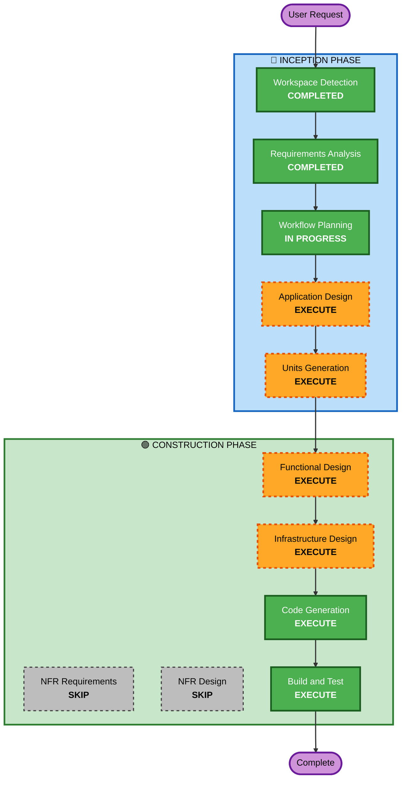

# Execution Plan — Economic Blast Radius Engine

## Detailed Analysis Summary

### Transformation Scope
- **Transformation Type**: Architectural — shifting from design doc's FastAPI-on-EC2 to Lambda + API Gateway
- **Primary Changes**: Build complete analysis engine (parser, calculator, mapper, exposure, comparator) as Lambda functions behind API Gateway; connect existing frontend to live API
- **Related Components**: CDK backend stack, S3 data bucket, frontend API hooks

### Change Impact Assessment
- **User-facing changes**: Yes — frontend transitions from hardcoded demo data to live API-driven results
- **Structural changes**: Yes — new Lambda-based backend architecture (design doc specified EC2)
- **Data model changes**: Yes — new Pydantic/dataclass models for analysis pipeline
- **API changes**: Yes — new POST /api/analyze and GET /api/zcta-boundaries endpoints
- **NFR impact**: Yes — Lambda cold starts may affect 5-second target; S3 reads per invocation add latency

### Component Relationships
```
Frontend (Next.js) ──→ API Gateway ──→ Lambda (Analysis Engine)
                                           │
                                           ├──→ S3 (LODES Parquet, XWALK Parquet, WARN CSV, ZCTA GeoJSON)
                                           ├──→ BLS QCEW API (external)
                                           └──→ Census CBP API (external)
```

### Risk Assessment
- **Risk Level**: Medium — multiple external data sources, new Lambda architecture, tight hackathon timeline
- **Rollback Complexity**: Easy — CDK stack can be destroyed, frontend reverts to hardcoded data
- **Testing Complexity**: Moderate — property-based tests for calculation logic, integration tests for external APIs

---

## Workflow Visualization



### Text Alternative
```
Phase 1: INCEPTION
  - Workspace Detection (COMPLETED)
  - Reverse Engineering (SKIPPED — spec docs sufficient)
  - Requirements Analysis (COMPLETED)
  - User Stories (SKIPPED — hackathon scope, demo-focused)
  - Workflow Planning (IN PROGRESS)
  - Application Design (EXECUTE — new components needed)
  - Units Generation (EXECUTE — 10 units identified)

Phase 2: CONSTRUCTION
  - Functional Design (EXECUTE — complex business logic: Moretti multiplier, commute mapping, exposure scoring)
  - NFR Requirements (SKIP — NFRs already defined in requirements doc)
  - NFR Design (SKIP — Lambda + S3 architecture is straightforward)
  - Infrastructure Design (EXECUTE — CDK stack for Lambda + API Gateway + S3)
  - Code Generation (EXECUTE — parallel backend + frontend workstreams)
  - Build and Test (EXECUTE — property-based + unit + integration tests)

Phase 3: OPERATIONS
  - Operations (PLACEHOLDER)
```

---

## Phases to Execute

### 🔵 INCEPTION PHASE
- [x] Workspace Detection (COMPLETED)
- [x] Reverse Engineering (SKIPPED — existing spec docs provide complete system documentation)
- [x] Requirements Analysis (COMPLETED — 10 FRs, 6 NFRs, 6 gaps identified and resolved)
- [x] User Stories (SKIPPED — hackathon demo with single primary scenario, no multi-persona complexity)
- [x] Workflow Planning (IN PROGRESS)
- [ ] Application Design — EXECUTE
  - **Rationale**: New backend components needed (Event Parser, Impact Calculator, Commute Mapper, Business Exposure Analyzer, BLS Comparator, Data Pipeline). Architecture shift from EC2 to Lambda requires component redesign.
- [ ] Units Generation — EXECUTE
  - **Rationale**: 10 units of work already identified in tasks.md. Need formal decomposition with dependencies for parallel execution via sub-agents.

### 🟢 CONSTRUCTION PHASE
- [ ] Functional Design — EXECUTE (per-unit, for Units 2-6: analysis engine components)
  - **Rationale**: Complex business logic requiring detailed design — Moretti multiplier calculations, LODES commute flow distribution, CBP exposure scoring, QCEW projected quarter arithmetic.
- [ ] NFR Requirements — SKIP
  - **Rationale**: NFRs already comprehensively defined in requirements doc (performance targets, cache TTLs, data freshness, security). No additional NFR discovery needed.
- [ ] NFR Design — SKIP
  - **Rationale**: Lambda + S3 + API Gateway is a well-understood serverless pattern. No complex NFR design patterns needed beyond what CDK provides.
- [ ] Infrastructure Design — EXECUTE (for Unit 9: CDK stack)
  - **Rationale**: Architecture shifted from EC2 to Lambda + API Gateway. CDK stack needs Lambda functions, API Gateway, S3 bucket, IAM roles. This is a significant infrastructure change from the empty scaffold.
- [ ] Code Generation — EXECUTE (ALWAYS, parallel workstreams)
  - **Rationale**: All implementation work. Backend and frontend built simultaneously via sub-agents.
- [ ] Build and Test — EXECUTE (ALWAYS)
  - **Rationale**: 15 property-based tests, unit tests, integration tests per design doc testing strategy.

### 🟡 OPERATIONS PHASE
- [ ] Operations — PLACEHOLDER

---

## Package Change Sequence

Given parallel development via sub-agents:

**Workstream A (Backend):**
1. `data/` — Data ingestion scripts (LODES, XWALK, WARN, ZCTA)
2. `backend/app/` — Analysis engine modules (parser → calculator → mapper → exposure → comparator)
3. `backend/app/main.py` — FastAPI/Lambda handler + API endpoints
4. `backend/lib/backend-stack.ts` — CDK infrastructure (Lambda + API Gateway + S3)

**Workstream B (Frontend):**
1. `frontend/src/types/` — TypeScript interfaces matching API contract
2. `frontend/src/hooks/` — API integration hooks (useAnalysis, useZCTABoundaries)
3. `frontend/src/components/` — Dashboard panels connected to live data
4. `frontend/src/utils/` — Dollar formatting utilities

**Integration Point:**
- Connect frontend API hooks to deployed backend endpoint
- End-to-end testing with Intel Chandler demo scenario

---

## Estimated Timeline
- **Total Stages to Execute**: 7 (Application Design, Units Generation, Functional Design, Infrastructure Design, Code Generation, Build and Test)
- **Stages Skipped**: 5 (Reverse Engineering, User Stories, NFR Requirements, NFR Design, Operations)
- **Estimated Duration**: Given parallel sub-agent execution, approximately 4-6 AI-DLC interactions to complete through Code Generation + Build and Test

## Success Criteria
- **Primary Goal**: Working end-to-end analysis pipeline — user enters "Intel lays off 1,500 at Chandler, AZ" → receives complete impact analysis with map, dollar figures, ZIP rankings, business exposure, and BLS comparison
- **Key Deliverables**: Lambda-based backend API, connected frontend dashboard, CDK infrastructure stack, property-based test suite
- **Quality Gates**: All 15 design properties validated via Hypothesis tests, API contract matches design doc, sub-5-second response with cached data
